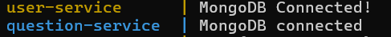

# CS3219-AY22-23-Project-Skeleton

## PeerPrep

### Pre-requisition

1. Ensure you have "Node.js" installed on your PC. ([download](https://nodejs.org/en/download))
2. Ensure that you have the application "Docker Desktop" installed , you may download the application from [docker website](https://docs.docker.com/get-docker/)

### Quick Start
To run "peerprep-g01" application, please perform the following steps:
1. Open "Docker Desktop". 
2. Navigate to the folder that you would like to store the project at in the File explorer, right click and select ***Open in Terminal***. 
3. Run `git clone https://github.com/TIC3001-AY2324S2/peerprep-g01?tab=readme-ov-file`
4. Run `cd peerprep-g01` to go into the repository. 

Run on terminal:
5. 'docker network create peerprep_network'
6. 'docker pull rabbitmq:3-management'
7. 'docker run -d --name some-rabbit -p 5672:5672 -p 15672:15672 --network peerprep_network rabbitmq:3-management'

You can now access the RabbitMQ management dashboard in your web browser at http://localhost:15672. 
Use the default credentials: username "guest" and password "guest".

8. on the terminal, enter `docker-compose start`. When you see the message as below means the docker containers are running successfully. 

     

9. In File explorer, navigate to folder "peerprep-g01" then to "public" folder. 
10. Run / double-click "index.html"

### Complete User Service Guide: [User Service Guide](./user-service/README.md)
